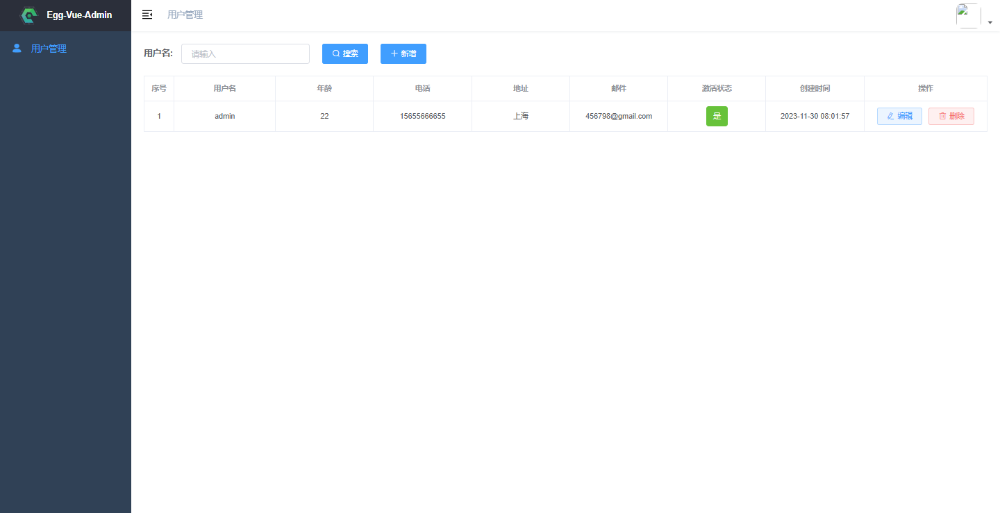

# Egg-project-template

#### 介绍
这是一个Egg+Vue+MongoDB的全栈简易后台项目学习示例。功能包括：JWT校验，密码加盐，统一异常处理，请求参数校验，mongoose,模板示例用户管理，增删改查功能，实例路由实现RESTful风格。
前端：VUE2全家桶+element-ui+axios+js-cookie...
后端：Egg.js+mongoose+jwt...

#### 软件架构
1. 服务端：Node+MongoDB@6...
2. 前端：Vue全家桶...

#### 安装教程

1.  npm install
2.  npm run dev

#### 使用说明

1.  本地需安装mongodb环境，启动服务、创建user数据库，创建user集合并添加一个用户

#### 参与贡献

1.  Fork 本仓库
2.  新建 Feat_xxx 分支
3.  提交代码
4.  新建 Pull Request

#### 特技

1.  使用 Readme\_XXX.md 来支持不同的语言，例如 Readme\_en.md, Readme\_zh.md
2.  Gitee 官方博客 [blog.gitee.com](https://blog.gitee.com)
3.  你可以 [https://gitee.com/explore](https://gitee.com/explore) 这个地址来了解 Gitee 上的优秀开源项目
4.  [GVP](https://gitee.com/gvp) 全称是 Gitee 最有价值开源项目，是综合评定出的优秀开源项目
5.  Gitee 官方提供的使用手册 [https://gitee.com/help](https://gitee.com/help)
6.  Gitee 封面人物是一档用来展示 Gitee 会员风采的栏目 [https://gitee.com/gitee-stars/](https://gitee.com/gitee-stars/)
